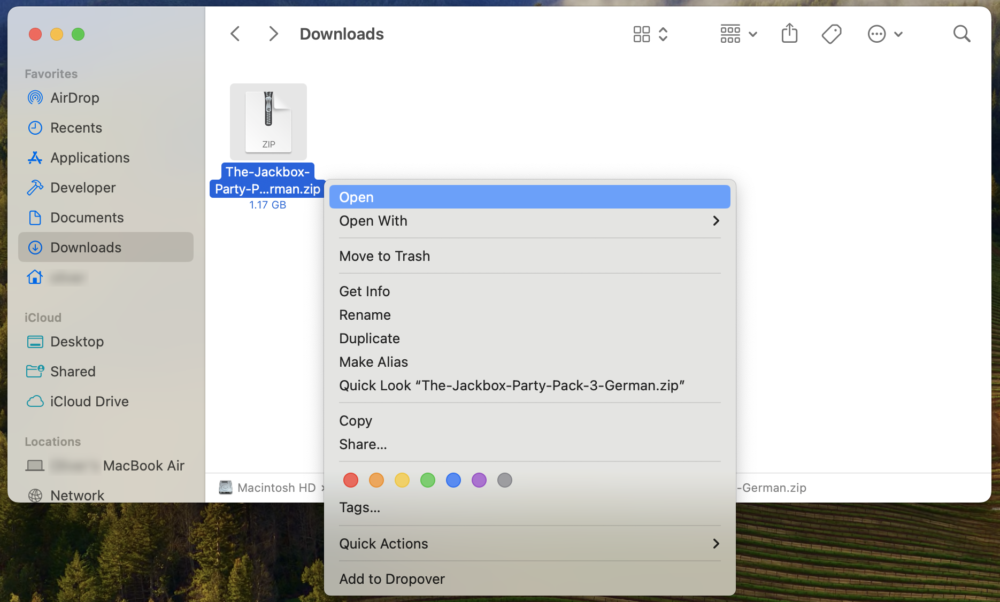

# Installation auf macOS

In diesem Artikel erklären wir dir Schritt für Schritt, wie du die Deutsch-Patches manuell auf macOS-Systemen installieren kannst.

!!! warning "Wir empfehlen ausdrücklich die Verwendung von Jackbox Utility"
    Um den Installations-Vorgang so einfach wie möglich zu gestalten, haben wir die Software [**Jackbox Utility**](https://jackboxpatch.de/downloads) entwickelt. Diese Software ist die **schnellste** und **sicherste** Methode, die Deutsch-Patches zu installieren. Jackbox Utility ist auch für macOS verfügbar.
    <br>
    Wir arbeiten aktiv an den Übersetzungen und veröffentlichen regelmäßig Updates zu allen Spielen. Mit Jackbox Utility stellst du sicher, dass du immer auf dem neuesten Stand bist.

!!! warning ""
    Bitte befolge diese Anleitung ganz genau und überspringe keinen Schritt. Andernfalls kann es zu Fehlern wie Blackscreens in den Spielen kommen.

## :blue_book: Anleitung

Es gibt zwei Möglichkeiten, wie du die Deutsch-Patches für die Spiele von Jackbox Games installieren kannst.
Methode 1 erfordert die Installation von **WinZip**. Dieses Programm bietet eine mehr als 30-tägige kostenlose Testversion, ist danach aber kostenpflichtig. Methode 2 erfordert die Verwendung des **Terminals** (Kommandozeile).

Wenn du noch keine Erfahrung mit der Kommandozeile hast, empfehlen wir die **WinZip**-Methode.

=== "WinZip"
    1. Lade dir [**WinZip**](https://www.winzip.com/en/mac/) herunter und installiere das Programm (30 tägige, kostenlose Testphase).
    2. Lade dir die ZIP-Datei für das entsprechende Party Pack [**hier**](https://jackboxpatch.de/downloads) herunter.
    3. Öffne in einem zweiten Fenster den Ordner mit deinem Spiel im Finder.
    !!! info "So findest du den Ordner über Steam"
        1. Rechtsklicke auf das Party Pack Spiel in deiner Steam-Bibliothek und klicke auf "Verwalten"  
        2. Klicke dann auf "Lokale Dateien durchsuchen". Es öffnet sich der Dateipfad im Finder  
    4. Rechtsklick auf die App und "**Paketinhalt anzeigen**" auswählen.
    5. Dort in den Ordner `Contents/Resources/macos` navigieren, die ZIP-Datei vom Patch mit **WinZip** öffnen, und alle Dateien in den Ordner des Spieleverzeichnis via Drag and Drop ziehen.

    !!! tip "Video-Tutorial"
        Die spanische Jackbox-Community hat [hier](https://youtu.be/RTb0_aFtLLY) ein ausführliches Video hochgeladen, welches diese Installations-Methode genauer behandelt.

=== "Terminal"
    1. Lade dir die ZIP-Datei für das entsprechende Party Pack [**hier**](https://jackboxpatch.de/downloads) herunter und extrahiere es in den Downloads-Ordner. Stelle sicher, dass es in einem Ordner mit demselben Namen wie der Patch extrahiert wurde.
    
    
    2. Greife mit dem Terminal auf das Verzeichnis zu, in dem sich die Packs befinden.
    ```
    cd ~/Library/Application\ Support/Steam/steamapps/common/
    ```
    Mit dem "ls"-Befehl kannst du den Inhalt des Ordners anzeigen, indem du dich gerade befindest.
    
    3. Navigiere in den "macos/"-Ordner des zu patchenden Spiels.
    ```
    cd /The\ Jackbox\ Party\ Pack\ 3/The\ Jackbox\ Party\ Pack\ 3.app/Contents/Resources/macos
    ```
    
    4. Installiere die Patches mit dem `ditto` Befehl. Wenn die Dateien der Übersetzungen sich im "Downloads" Ordner befinden, muss folgender Befehl verwendet werden:
    ```
    ditto ~/Downloads/The-Jackbox-Party-Pack-3-German .
    ```
    
    **Wichtig:** Nicht den ZIP-Ordner auswählen. Der Punkt ist wichtig, da dieser den aktuellen Ordner als Ziel für den Kopier-Befehl festlegt. Der genaue Ordnername kann abhängig vom Spiel abweichen. 

    !!! tip "Video-Tutorial"
        Die spanische Jackbox-Community hat [hier](https://drive.google.com/file/d/1cqZ2mi9CKJwuc3pitR59f3jDASlKAvRF/view) ein ausführliches Video hochgeladen, welches diese Installations-Methode genauer behandelt.

!!! info "Mögliche Fehlerursachen"
    Falls das Spiel nach der Installation nicht mehr starten sollte, haben wir hier einige [**mögliche Fehlerursachen**](../Problembehebung/MacOSFehlermeldung.md) zusammengestellt.

!!! warning "Einschränkungen aufgrund der Hardware"
    Derzeit erreichen uns Meldungen, dass einige Patches nicht für alle macOS-Systeme funktionieren. Da andere macOS-Nutzer keine Probleme feststellen konnten, vermuten wir, dass es bei unterschiedlichen Modellen zu verschiedenen Ergebnissen führt. Wir sind gerade noch dabei, weitere Informationen zu sammeln. Falls du bei den Tests und der Entwicklung beitragen möchtest, trete doch gerne unserem [Discord-Server](https://discord.gg/vGcu9HWde4) bei.

!!! warning "Inkompatibilität mit Epic Games"
    Aufgrund von neuen Änderungen seitens Jackbox Games sind einige unsere Deutsch-Patches derzeit **nicht mit Epic Games kompatibel**. Wir arbeiten bereits an einer Lösung. Auf unserer [Webseite](https://jackboxpatch.de/downloads) findest du eine Übersicht aller zur Verfügung stehender Patches.